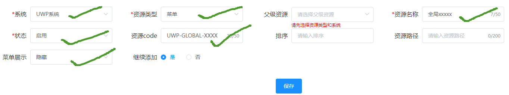

## 背景
由于uwp/suwp都没全局权限这个功能，故此借用路由配置的功能，在前端实现权限控制

配置路由时，配置如下打勾的项即可

  - 资源类型必须为  菜单
  - 菜单展示必须为  隐藏
  - 资源code规则   中间必须添加 -GLOBAL- (此为作为全局权限的过滤标识，正常路由禁止添加)

## 安装
```bash
npm i '@mc/global-routecode-permission'
```

## 用法
```js
// 引入
import globalRoutecodePermission from '@mc/global-routecode-permission';
// 注册
Vue.use(globalRoutecodePermission);
```
如果组件中包含异步请求等处理，或者组件很大及影响性能，请使用 v-if 会直接移除不做渲染

指令的用法则是，先渲染出来，再作节点移除处理，可用作简单的标签权限控制
```html
<!-- 条件判断用法 -->
<comp v-if="grcode({code: 'UWP-GLOBAL-XSGG2'})" />
<!-- 指令用法 -->
<div v-grcode="{code: 'UWP-GLOBAL-XSGG3'}">xxxx</div> 
```